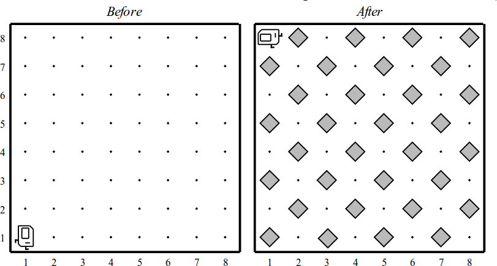
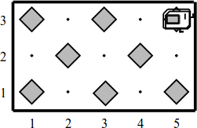
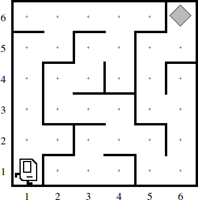

# Karel the Robot

"Karel is a very simple robot living in a very simple world. By giving Karel a
set of commands, you can direct it to perform certain tasks within its
world. The process of specifying those commands is called
programming. Initially, Karel understands only a very small number of predefined
commands, but an important part of the programming process is teaching Karel new
commands that extend its capabilities".[^1]

## Getting started

* Go into the `prog` directory you made in the Getting Started by executing

       cd prog

* Create another directory for this problem set (`mkdir pset1`) and `cd` into
  that as well.
* You can get the starter kit [here](cdn://pset1.zip) you can download it with
  `wget <url>`.
* Unpack it in the current directory with `unzip pset1.zip`.
* Compile all your source files by issuing the `make` command. If everything
  went well, you get no errors.
* Try running the first problem using

       java -cp .:karel.jar CollectNewspaperKarel

This runs the CollectNewspaperKarel class. But alas, nothing happens if your
press **run** of course, because you still have to implement the code!

* Now, when in the `pset1` directory, run the following command to start your
  editor and get programming!

## About the use of variables

All of these exercises are designed to be solvable without the use of
variables. Even more so, they are *harder* to solve without variables! That is
why you cannot use them in your solutions. That is because these exercises aim
to learn you the first steps in algorithmic problem solving. The solutions to
these exercises can be very elegantly expressed without variables.

## Problem 1

Your first task is to solve a simple story-problem in Karel’s world. Suppose
that Karel has settled into its house, which is the square area in the center of
the following diagram:

Karel starts off in the northwest corner of its house as shown in the
diagram. The problem you need to get Karel to solve is to collect the
newspaper—represented (as all objects in Karel’s world are) by a beeper—from
outside the doorway and then to return to its initial position.

This exercise is extremely simple and exists just to get you started. You can
assume that every part of the world looks just as it does in the diagram. The
house is exactly this size, the door is always in the position shown, and the
beeper is just outside the door. Thus, all you have to do is write the sequence
of commands necessary to have Karel

1. Move to the newspaper,
2. Pick it up, and
3. Return to its starting point.

Even though the program is only a few lines, it is still worth getting at least
a little practice in decomposition. In your solution, include a private method
for each of the steps shown in the outline.

Implement your solution in the file `CollectNewspaperKarel.java` that is
provided in the starter kit.

## Problem 2

Karel has been hired to repair the damage done to the Quad in the 1989
earthquake. In particular, Karel is to repair a set of arches where some of the
stones (represented by beepers, of course) are missing from the columns
supporting the arches, as follows:

Your program should work on the world shown above, but it should be general
enough to handle any world that meets certain basic conditions as outlined at
the end of this problem. There are several example worlds in the starter folder,
and your program should work correctly with all of them.

When Karel is done, the missing stones in the columns should be replaced by
beepers, so that the final picture resulting from the world shown above would
look like this:

Karel may count on the following facts about the world:

* Karel starts at 1st Avenue and 1st Street, facing east, with an infinite
  number of beepers.
* The columns are exactly four units apart, on 1st, 5th, 9th Avenue, and so
  forth.
* The end of the columns is marked by a wall immediately after the final
  column. This wall section appears after 13th Avenue in the example, but your
  program should work for any number of columns.
* The top of the column is marked by a wall, but Karel cannot assume that
  columns are always five units high, or even that all columns are the same
  height.
* Some of the corners in the column may already contain beepers representing
  stones that are still in place. Your program should not put a second beeper on
  these corners.

Implement your solution in `StoneMasonKarel.java`.

## Problem 3

In this exercise, your job is to get Karel to create a checkerboard pattern of
beepers inside an empty rectangular world, as illustrated in the following
before-and-after diagram:

This problem has a nice decomposition structure along with some interesting
algorithmic issues. As you think about how you will solve the problem, you
should make sure that your solution works with checkerboards that are different
in size from the standard 8 x 8 checkerboard shown in the example. Odd-sized
checkerboards are tricky, and you should make sure that your program generates
the following pattern in a 5 x 3 world:

Another special case you need to consider is that of a world which is only one
column wide or one row high. The starter folder contains several sample worlds
that test these special cases, and you should make sure that your program works
for each of them.

Implement your solution in `CheckerboardKarel.java`.

## Problem 4

As an exercise in solving algorithmic problems, program Karel to place a single
beeper at the center of 1st Street. For example, if Karel starts in the world

it should end with Karel standing on a beeper in the following position:

Note that the final configuration of the world should have only a single beeper
at the midpoint of 1st Street. Along the way, Karel is allowed to place
additional beepers wherever it wants to, but must pick them all up again before
it finishes.

In solving this problem, you may count on the following facts about the world:

* Karel starts at 1st Avenue and 1st Street, facing east, with an infinite
  number of beepers in its bag.
* The initial state of the world includes no interior walls or beepers.
* The world need not be square, but you may assume that it is at least as tall
  as it is wide.

Your program, moreover, can assume the following simplifications:

* If the width of the world is odd, Karel must put the beeper in the center
  square. If the width is even, Karel may drop the beeper on either of the two
  center squares.
* It does not matter which direction Karel is facing at the end of the run.

There are many different algorithms you can use to solve this problem. The
interesting part of this assignment is to come up with a strategy that works.

Implement your solution in `MidpointFindingKarel.java`.

## Problem 5

In this exercise you are going to make Karel solve mazes. A maze in the world of
Karel looks like this:

The exits of a maze are marked by a beeper. You can assume these are the only
beepers in the world. Placing extra beepers is allowed, but take care not to
confuse these with the real exits!

The files include five mazes, numbered 1 through 5. Your solution should be a
single class, `MazeSolvingKarel`, which can move Karel to the exit of the first
two mazes.

### Hacker edition (optional)

Looking for a challenge? Then try to solve all mazes. The first two mazes can be
solved by following simple rules, the remaining three however are more
difficult.

Want some ideas to solve the harder mazes? Try
[this page](http://www.astrolog.org/labyrnth/algrithm.htm). Also note that
`SuperKarel` is capable of painting floors. This can help keep track of where
you've been.

## Adding comments

The five problems in this problem set do not usually require a lot of
comments. We would like to see, however, atop each function, a short description
of what it does.

Also, you should describe the algorithms you used in Problem 5, by inserting
comments throughout those.

And finally, make very sure that your files include a short top comment
describing what the program does, and your name!

## Submitting your work

* You should at the very least have solved Problems 1-5.
* In Problems 1-4, your program should work for **every relevant world** that
  came with the starter kit! For Problem 5 you're only required to solve the
  first two mazes.
* Create a ZIP-file of your work. Make sure your teaching assistant can run your
  program without modification! Otherwise it will probably be sent back to you
  without a grade.
* Go to the submit tab and send your ZIP-file to us. After the weekend, you'll
  see if you got a grade or if your submission was rejected.
* In all cases, ask your assistant for feedback on the problem set.

[^1]: From [Karel the robot learns Java](http://www.stanford.edu/class/cs106a/handouts/karel-the-robot-learns-java.pdf)
