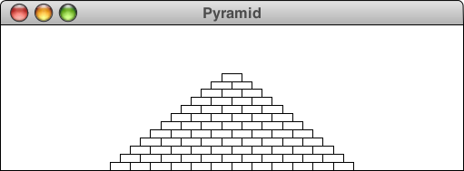
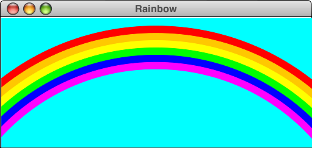

# Graphics Programs

Download the starter kit from [here](cdn://pset2.zip) and extract it in your
**Dropbox** directory. All the files needed for this problem set are included.

## Problem 3: `Pyramid.java`

Write a `GraphicsProgram` subclass that draws a pyramid consisting of bricks
arranged in horizontal rows, so that the number of bricks in each row decreases
by one as you move up the pyramid, as shown in the following sample run:

The pyramid should be centered at the bottom of the window and should use
constants for the following parameters:

| variable         | description                           |
|------------------|---------------------------------------|
| `BRICK_WIDTH`    | The width of each brick (30 pixels)   |
| `BRICK_HEIGHT`   | The height of each brick (12 pixels)  |
| `BRICKS_IN_BASE` | The number of bricks in the base (12) |

A constant is declared by preceding the variable with the keywords `final` and
`static`. Constants are usually declared at class level, right below the opening
brace. See the example below.

~~~ java
public class Pyramid extends GraphicsProgram
{
    static final int BRICK_WIDTH = 30;
}
~~~

The numbers in parentheses show the values for this diagram, but you must be
able to change those values in your program.

Documentation for the acm library:

* [GraphicsProgram](http://jtf.acm.org/javadoc/student/acm/program/GraphicsProgram.html)
* [GRect](http://jtf.acm.org/javadoc/student/acm/graphics/GRect.html)

## Problem 4: `Rainbow.java`

Write a `GraphicsProgram` subclass that draws a rainbow that looks like this:

The colors of the stripes are clear in the web version of the picture, but are
hard to see in the black-and-white handout. Starting at the top, the six arcs
are red, orange, yellow, green, blue, and magenta, respectively; cyan makes a
lovely color for the sky.  At first glance, it might seem as if you need to draw
arcs on the screen, even though you won't actually learn about the `GArc` class
until Lecture 10. As it turns out, that class doesn't really help much. The
program that produced the diagram shown at the bottom of the previous page uses
only circles, although seeing how this is possible forces you to think outside
the box—in a literal rather than a figurative sense. The common center for each
circle is some distance below the bottom of the window, and the diameters of the
circles are wider than the screen. The `GraphicsProgram` shows only the part of
the figure that actually appears in the window. This process of reducing a
picture to the visible area is called clipping.

Rather than specify the exact dimensions of each circle, play around with the
sizes and positioning of the circles until you get something that matches your
aesthetic sensibilities. The only things we'll be concerned about are:

* The top of the arc should not be off the screen.
* Each of the arcs in the rainbow should get clipped along the sides of the top,
  and not along the bottom.
