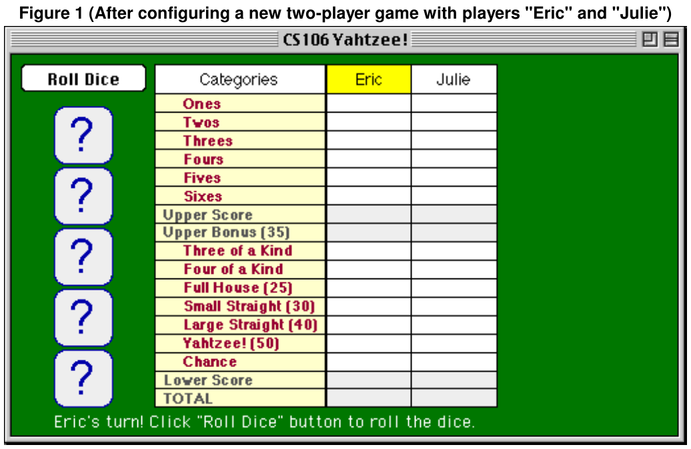
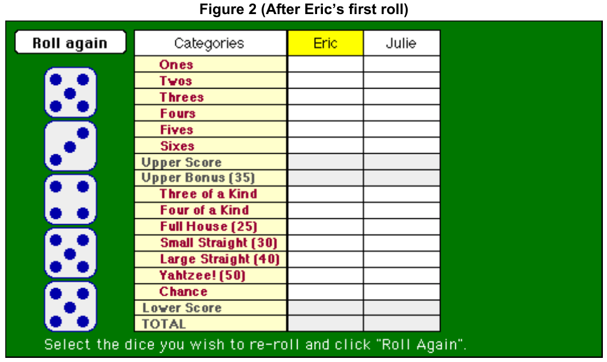
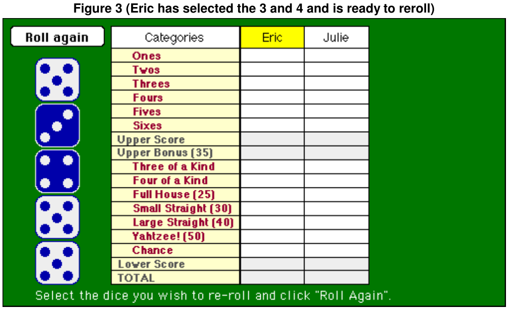
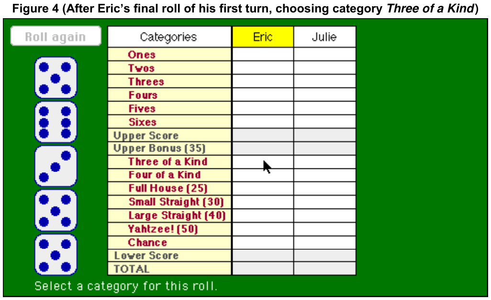
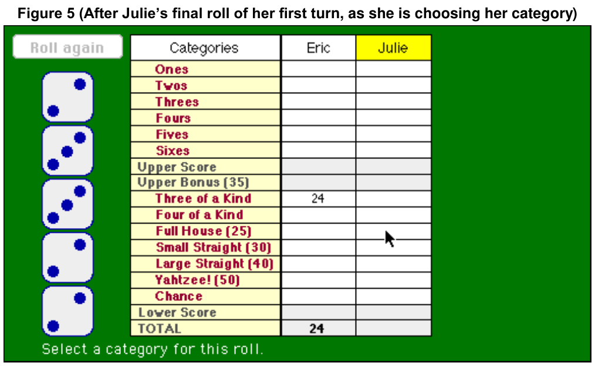
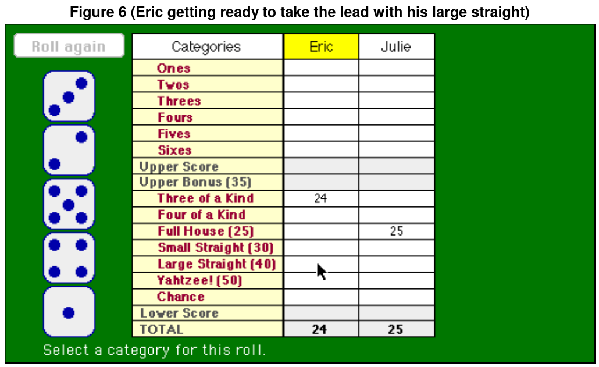
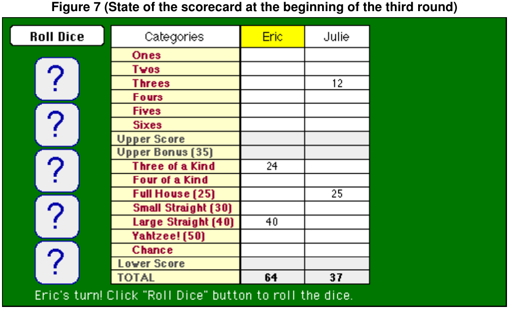
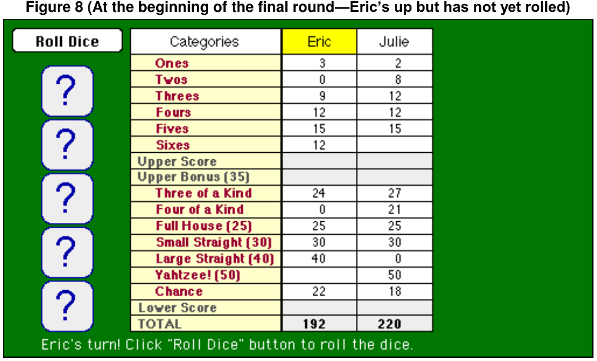
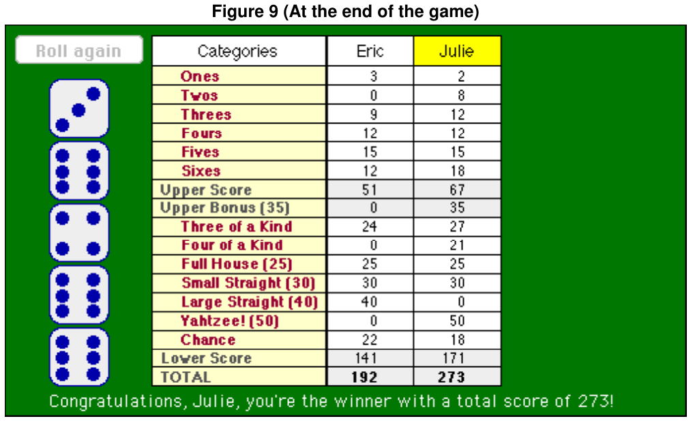
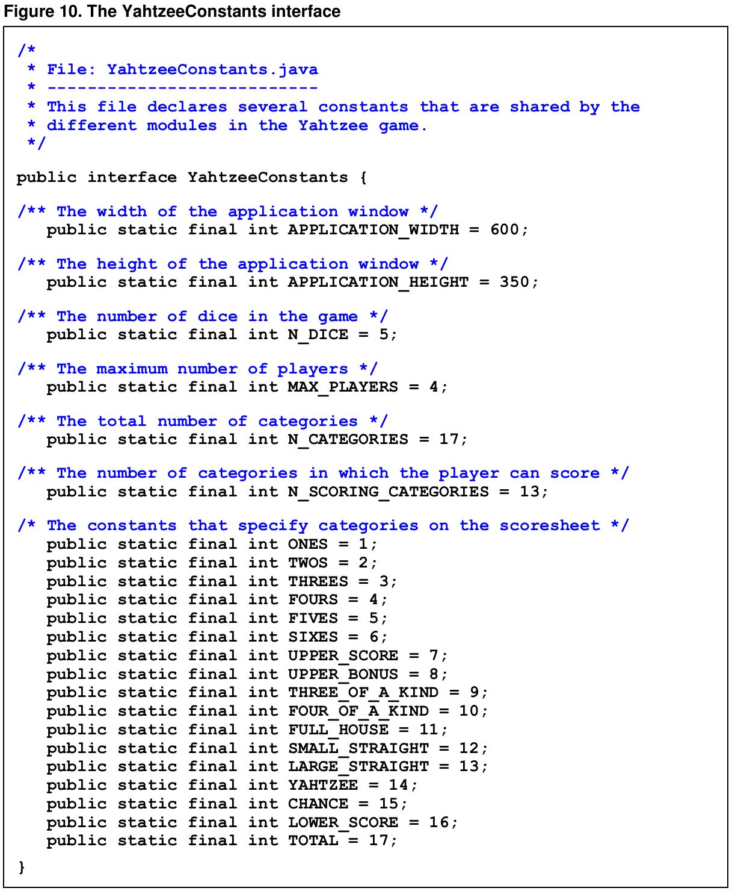

# Yahtzee

Note: Yahtzee is the trademarked name of a game produced by Hasbro. We refer to this
game for educational purposes only. Okay, we also like to have fun playing the game.
But then again, something can be both *educational* and *fun* (hopefully, like this course),
so we shouldn't run into any problems there. Thanks for listening. We now return to our
previously scheduled assignment.

### Arrays, arrays, everywhere...

Now that you have have arrays at your disposal, your ability to write interesting programs
takes a dramatic leap forward. To solidify your understanding, problem set 4 uses
arrays in a variety of contexts to implement a popular multiplayer dice game. There are
arrays for the dice, arrays for the dice to reroll, arrays for the player names, arrays for a
player’s score, and even an array of arrays (that is, a 2-dimensional array) to handle the
entire scorecard. By the time you’re done, you will be well on your way to mastering the
concept of arrays.

### The goal

Your task is to create a computer version of the game Yahtzee. Some of you may have
already played the game, but for those who haven’t, it’s simple to learn. There are five
dice and one to four players. A *round* of the game consists of each player taking a turn.
On each *turn*, a player rolls the five dice with the hope of getting them into a
configuration that corresponds to one of 13 categories (see the following section on **Dice
Categories**). If the first roll doesn’t get there, the player may choose to roll any or all of
the dice again. If the second roll is still unsuccessful, the player may roll any or all of the
dice once more. By the end of the third roll, however, the player must assign the final
dice configuration to one of the thirteen categories on the scorecard. If the dice
configuration meets the criteria for that category, the player receives the appropriate score
for that category; otherwise the score for that category is 0. Since there are thirteen
categories and each category is used exactly once, a game consists of thirteen rounds.
After the thirteenth round, all players will have received scores for all categories. The
player with the total highest score is declared the winner.

### Dice categories

The thirteen categories of dice configurations and their scores are:

1. *Ones.* Any dice configuration is valid for this category. The score is equal to the
sum of all of the 1’s showing on the dice, which can be 0.
2. *Twos.* Any dice configuration is valid for this category. The score is equal to the
sum of all of the 2’s showing on the dice, which can be 0.
3. *Threes.* Any dice configuration is valid for this category. The score is equal to the
sum of all of the 3’s showing on the dice, which can be 0.
4. *Fours.* Any dice configuration is valid for this category. The score is equal to the
sum of all of the 4’s showing on the dice, which can be 0.
5. *Fives.* Any dice configuration is valid for this category. The score is equal to the
sum of all of the 5’s showing on the dice, which can be 0.
6. *Sixes.* Any dice configuration is valid for this category. The score is equal to the
sum of all of the 6’s showing on the dice, which can be 0.
7. *Three of a Kind.* At least three of the dice must show the same value. The score is
equal to the sum of all of the values showing on the dice.
8. *Four of a Kind.* At least four of the dice must show the same value. The score is
equal to the sum of all of the values showing on the dice.
9. *Full House.* The dice must show three of one value and two of another value. The
score is 25 points.
10. *Small Straight.* The dice must contain at least four consecutive values, such as the
sequence 2-3-4-5. The score is 30 points.
11. *Large Straight.* The dice must contain five consecutive values, such as the
sequence 1-2-3-4-5. The score is 40 points.
12. *Yahtzee!* All of the dice must show the same value.. The score is 50 points.
13. *Chance.* Any dice configuration is valid for this category. The score is equal to the
sum of all of the values showing on the dice.

### Running the applet

As outlined in the section entitled **What is provided**, all the
methods to implement the graphics and mouse interaction have been written for you.
This section describes the way the program works as a whole.

When the program begins, it displays a welcome message and asks the user to enter the
number of players. It then asks the user to enter the names of the players, one at a time.
Suppose that there are two players—Eric and Julie—locked in a cutthroat, head-to-head,
winner-take-all showdown. After you use the pop-up dialog boxes to enter the names
`Eric` and `Julie`, the applet displays the starting Yahtzee scorecard and dice in the
graphics window, as shown in Figure 1.

### The Yahtzee scoreboard

It’s worth taking a minute to two to look at the Yahtzee scoreboard. The 13 categories
that make up the game are divided into two sections. The upper section contains the
categories *Ones*, *Twos*, *Threes*, and so forth. At the end of the game, the values in these
categories are added to generated the value in the entry labeled *Upper Score*. Moreover,
if a player’s score for the upper section ends up totaling 63 or more, that player is
awarded a 35-point bonus on the next line. The scores in the lower section of the
scorecard are also added together to generate the entry labeled *Lower Score*. The total
score for each player is then computed by adding together the upper score, the bonus (if
any), and the lower score.

### Playing a sample game

The game shown in Figure 1 is now ready to begin. Eric is first, so his name is
highlighted in the scorecard, which also displays the following message:

    Eric's turn. Click "Roll Dice" button to roll the dice.

When Eric clicks the **Roll Dice** button, the dice are randomly rolled, resulting in a display
that looks like the diagram shown in Figure 2.

At first glance, these numbers look wonderful, with three 5’s already! Thinking that he
has a chance for the *Yahtzee* category, Eric wants to reroll the 3 and the 4. To indicate
this choice, all Eric has to do is click on these two dice. Doing so highlights these dice as
follows:

To reroll the selected dice, all the player has to do is click on the **Roll again** button. Until
this button is clicked, the player can select or deselect any particular die by clicking on it.
For example, if Eric decided instead to try for some kind of straight, he could deselect the
3 and the 4 by clicking on them and then selecting new dice (presumably two of the
5’s) by clicking on these.

Always overconfident, Eric decides to go for the *Yahtzee* and rerolls just the 3 and 4.
Unfortunately, Eric doesn’t get any more 5’s on his second roll, so he selects those same
two dice for his final roll, but is again unsuccessful in his quest for more 5’s. Eric ends
up with the three 5’s, a 6, and a 3, as shown in Figure 4.

While Eric didn’t manage to secure a *Yahtzee*, he did come up with a reasonably decent
*Three of a Kind*. When asked to choose a category, Eric clicks *Three of a Kind*, and a
score of 24 points will be recorded in the column.

Now it’s Julie’s turn. Julie has better karma than Eric, but we won't talk about that right
now. Anyway, Figure 5 shows the configuration of the dice at the end of her three rolls:
three 2’s and two 3’s. Julie is quite pleased and plans to use this configuration for a *Full
House*, which is worth 25 points and gives her the early lead.

Now it’s Round #2. Eric is behind by one point and wants to seize the lead. His first roll
is 3, 5, 5, 4, 1. Eric sees that if he could just turn one of those 5’s into a 2 he would have
a large straight. He rolls the single die again and gets . . . a 2! He made it! Of course,
Eric doesn’t want to roll the dice again, so he simply clicks the **Roll again** button **without
selecting any more dice** and then selects the *Large Straight* category to end his turn, as
shown in Figure 6.

Julie’s not at all worried. She rolls the dice and gets three 3’s, a 6, and a 1. She keeps the
3’s and rerolls to get a 3 and 4. So close! She holds her breath and prays for another 3!
She rolls the single die and gets . . . a 1. Dejectedly, she uses the result for *Threes*; which
earns 12 points for her efforts. Eric goes into the third round with the commanding lead
shown in Figure 7.

The game continues in a similar fashion. On each turn, players must

1. Click on the **Roll Dice** button to set up the initial roll of all five dice.
2. Select a set of dice and then click the **Roll again** button to reroll the selected dice.
3. Repeat step 2 to generate the final dice configuration after the third roll.
4. Click on a category to store the score in the appropriate box.

Note that a player will sometimes have to choose a category that doesn’t match the
configuration of the dice, because there are no appropriate categories left. In such cases,
the player simply scores 0 in the selected box.

Let’s fast-forward to Round #13—the final round—where we find the tide has turned:

Eric is in trouble. Julie has already gotten her *Yahtzee*, and Eric desperately needs his. He
rolls the dice and gets a 1, 3, 4, and two 2’s. Uggh! He keeps the 2’s and rerolls the 1, 3,
and 4. Now he gets a 5, 6, and 3. He rolls these same dice yet another time. Nothing
much comes of it — just a 2, 4, and 6. Eric is forced to use this motley collection in the
*Yahtzee* category, which gets him a big, fat 0 (since it does not satisfy the criteria for an
actual *Yahtzee*). Too bad Eric — sometimes that's just how life turns out.

It’s Julie’s turn; all she has left is *Sixes*. She is already headed for victory, but she plows
ahead to rub it in. Julie’s first roll gives her one 6 along with four useless numbers. She
discards the junk and gathers two more 6’s during her two rerolls, earning a 18 in *Sixes*.

Since the game is now over, the upper and lower scores are computed and if applicable,
the upper bonus is awarded. Julie earned her upper bonus, since those last 6’s pushed her
upper score over 63. Eric, however, fell short. Julie shows Eric who’s boss with a final
score of 273 to 192 (shown below)!

### What is provided in the starter project

The starter project provides the following:

* A `Yahtzee.java` file that you need to expand to play the game. The initialization
code, however, is already provided.
* A `YahtzeeConstants.java` file that defines several constants used in the game. The
contents of this file appear in Figure 10. Some of these are simple
conveniences, such as defining the number of dice to be the named constant `N_DICE`.
The most important entries, for you to understand are the category constants at the end
of the file. These constants form an *enumeration* that allows you to refer to constants
on the score sheet. These constants are available to the `Yahtzee` class because it
declares itself as implementing the `YahtzeeConstants` interface.
* A precompiled class called `YahtzeeDisplay` (which is embedded in the file 
`yahtzeelib`) that manages all the graphics and event
handling. You’ve already shown your mettle with the graphics library on the previous 
assignments, so this time we’ll take the graphics off your plate. This class is discussed in
more detail in the section that follows.
* A precompiled class called `YahtzeeMagicStub` (which is also embedded in the file 
`yahtzeelib`) that exports a method `checkCategory`
that will allow you to get your program working a little sooner. You have to write this
method on your own before you submit your assignment, but having a working
implementation available means that you can test your scoring methods without having
to work out the details of this method as well.

## The YahtzeeDisplay class

As noted in the preceding section, the starter project contains a precompiled class called
`YahtzeeDisplay` that manages the drawing and event-handling. This section of the
handout offers a brief overview of the methods, which should be enough to get you
started. 

[Here is the link to the full documentation](YahtzeeDisplay.html)

* There is a constructor method `YahtzeeDisplay` that creates the initial display. It takes
as parameters the `GCanvas` for the Yahtzee program and an array containing the names
of each player. The call to this method is included in the `Yahtzee.java` starter file
we’ve provided to you.
* The `waitForPlayerToClickRoll` method is used at the beginning of each player’s
turn. It waits for the player to click the **Roll Dice** button indicating they are ready to take
their chances.
* The `displayDice` method draws the dice on the board. It takes an array of `N_DICE`
values. You call this method to draw the random dice results you generated on each
roll or reroll.
* The `waitForPlayerToSelectDice` method allows the player to click on the dice to
select and deselect which ones should be rerolled. You call this method on the second
and third rolls of the player’s turn to find out which dice they wish to reroll.
* The `isDieSelected` method allows you to check whether the player has chosen to
reroll a particular die. You call this method after `waitForPlayerToSelectDice`
returns to determine which dice you need to reroll and which you can leave alone.
* The `waitForPlayerToSelectCategory` method allows the player to click on the
scorecard to select a category. You call this method at the end of the player’s turn
when they need to choose the category to assign the current dice configuration. The
method returns the number of a category, as defined in `YahtzeeConstants`.
* The `updateScorecard` method updates a score entry on the scorecard. You call this
method at the end of the player’s turn to report the latest score. It takes a player
number, a category, and a value, and updates the scorecard to display that value in the
proper row and column.
* The `printMessage` method allows you to display a message at the bottom of the
graphics window. This method works exactly like `println` and allows you to include
values in exactly the same way. For example, if you want to display the message

    Eric's turn.

with the name Eric replaced by the contents of the string variable `name`, you could use
the following call to `printMessage`:

    display.printMessage(name + "'s turn.");

As this last example illustrates, any calls to the methods in the `YahtzeeDisplay` class
must include the variable `display` as the receiver. You are asking the display to print
a message and therefore must use the receiver-based style of method call.

Another point to which you should pay attention is that the methods in the
`YahtzeeDisplay` class take player numbers that run from 1 to the number of players, and
not from 0 to the number of players minus one. The latter is what you need for array
selection, but the former makes more sense to humans, who are unaccustomed to thinking
about a player 0. You might want to look at the section of Chapter 8 entitled ―Changing
the index range‖ for some guidance as to how to think about this small wrinkle in the
design, although it should be rather straightforward to deal with.

**Make sure to check the full documentation from the link above**

### Some strategies to consider

As always, we recommend first spending time thinking about the program before you
jump in and start coding. Consider what types of variables will be needed to store the
various information. How will you arrange the data and how will you pass it around in
the program? Sketching out a decomposition tree will be helpful here. Take time to
identify the parameters going into each method and the return value coming out. Also
consider how you plan to use the library routines in your solution. Be sure to read the
javadoc for `YahtzeeDisplay` (see the previous section) very carefully so that you 
thoroughly understand how the methods behave and the kinds of parameters they require.

One of the most interesting (and challenging) array tasks you will be faced with is
determining whether a dice configuration meets the requirements for a given category,
and is therefore valid. For example, *Three of a Kind* requires a dice configuration in
which at least three of the dice show the same value, *Small Straight* requires at least four
of the dice values to be consecutive, and so forth. If a player assigns an invalid dice
configuration to a category, they receive 0 points for it.

To make it easier for you to get your program working, we have provided a method called
`YahtzeeMagicStub.checkCategory`, which tests to see whether an array of dice values
matches a particular category. If you call this method with the array of dice and the index
of the category you’re checking for, `checkCategory` returns `true` if the values of the dice
stored in the array are valid for the category and `false` otherwise. Note some categories
(namely, *Chance* and *Ones*, *Twos*, etc.) accept any dice configuration; for these categories
`checkCategory` always returns `true`.

The javadoc describing the class `YahtzeeMagicStub` is available [here](YahtzeeMagicStub.html).

but for your convenience, we note that the static method
`YahtzeeMagicStub.checkCategory` can be called as follows (assuming we have an
array of ints named dice that we want to check to see if it matches the Full House
category):

    boolean p = YahtzeeMagicStub.checkCategory(dice, FULL_HOUSE);

In the early stages of your development, you can use our `checkCategory` method to help
you get up and running. Ultimately, however, you need to write this method yourself. As
you develop your own version of this method, you’ll probably want to test it in stages.
You could, for example, write a method that tests the validity of, say, *Three of a Kind*, but
uses the implementation from `YahtzeeMagicStub` for everything else. When that works,
you could move on to take care of *Four of a Kind*, and then *Yahtzee* and *Full House*.
Once you have your own methods for checking the validity of these categories, move on
to tackling *Small Straight* and *Large Straight*.

For full credit, you should **not** use `YahtzeeMagicStub.checkCategory` anywhere in the
final version of your program. If you find determining the validity of a certain category
or categories too difficult, you may use our method, but you will lose points for each
category whose validity you do not check with your own implementation.

In a similar vein, look for other intermediate milestones you can aim for instead of
heading straight for the final goal and letting it overwhelm you. For example, it is easier
to get a single-player game working than a multi-player game. If there is only one player,
you can work with a single array of scores. After you can reliably play a single-person
game, you can move on to support an array of players’ scores where a multidimensional
array will be needed.

You also might find it worthwhile to create a *cheat* mode during development. If you
are running in cheat mode, you can prompt the user to specify the values by typing them
in instead of choosing the dice randomly. Implementing this feature will make it easier
for you to check the various situations that can come up during the game, rather than
waiting and hoping for them to come up randomly at some point during your testing.

### Hints and other random details

* There’s not a great deal difference between determining the validity for *Three of a
Kind*, *Four of a Kind*, *Yahtzee*, and *Full House*.
* There’s not a great deal of difference between determining the validity for *Small
Straight* and *Large Straight*.
* Any dice configuration is valid for *Ones*, *Twos*, *Threes*, *Fours*, *Fives*, *Sixes*, and
*Chance*.
* A dice configuration assigned to a category where it doesn’t meet the requirements
receives a score of 0.
* You should print text messages along the way to inform the players what to do next
(whose turn it is, when the player should roll, when to select dice for rerolling, when to
choose a category, who the winner is, etc.).
* Be sure to check for errors when the player selects the category to assign a dice
configuration. The user **cannot** re-use any previous category. Print a message if you
cannot honor their choice and have them select another.
* On each turn, a player will roll the dice three times. If a player doesn’t want to change
anything on a subsequent roll, that player should click the **Roll again** button **without
selecting any dice**.
* At the end of the game, don’t forget to compute and assign the upper bonus (35 points
if their upper score is 63 or over), upper score, lower score, and final total.
* Be sure to mark all methods as `private` unless you explicitly plan for them to be used
outside the module. The grading criteria that we will use for the assignment will
include a deduction along these lines.

### Extensions

Since the standard assignment is pretty much a full implementation of the Yahtzee game,
it is hard to come up with ideas for extensions, but don’t let our lack of creativity stop you
from exploring things that you would find interesting. Here’s at least a few ideas that
occurred to us:

* *Add a high score feature.* Save the top ten highest scores and names to a file and make
it persistent between runs of the program. Read the file when you start and print out the
hall of fame. If a player gets a score that preempts one of the early high scores,
congratulate them and update the file before you quit so it is recorded for next time.
* *Incorporate the bonus scores for multiple Yahtzees in a game.* As long as you have not
entered a 0 in the Yahtzee box, the rules of the game give you a bonus chip worth 100
points for each additional Yahtzee you roll during the same game.
* *Beef up your Yahtzee to the variant called “Triple Yahtzee.”* In this variant, each
player manages three simultaneous scorecard columns, as if they were playing for three
players at once. The player can assign a roll to any one of their three columns. All
entries are scored normally with respect to categories and validity, but the values in the
second column are doubled, and the third column values are tripled. The player’s
score consists of the sum of all three columns. This would make for a three-
dimensional array (an array of players who have any array of columns which are an
array of score entries)—pretty tricky! Game play continues for 3*13 rounds, until all
players have filled in all entries in all three columns. The player with the highest total
score is the winner.

As always, you should only tackle extensions after you have completed and thoroughly
tested all the basic requirements. If you do create an extended version, please hand in
**both** a basic and an extended version to make it easier for us to verify the base
functionality. Small extensions that don’t disrupt the basic functionality are fine to
include in one version. Be sure to describe in your comments where we should look for
your fun additions!

