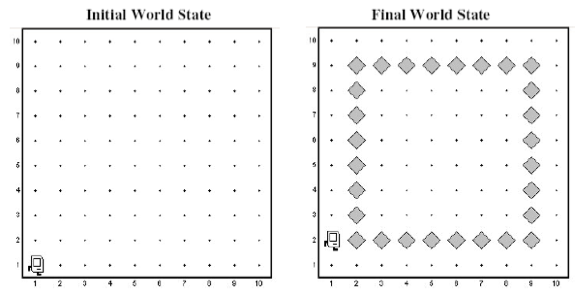
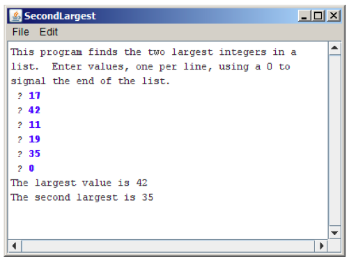
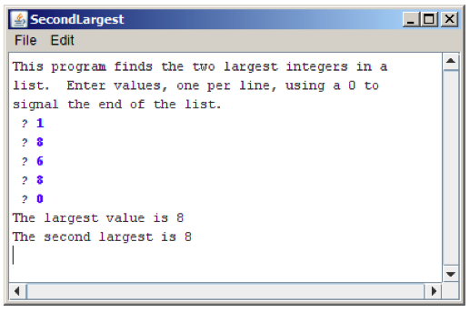

During the quiz, you are allowed to use one (1) sheet of A4 paper containing
written or typed notes on any subject, and a pen, nothing else.

You are to write your solutions on paper, in pseudocode or in real Java(TM),
and you do not need to remember or specify which libraries to `import` to use
special functions. You can use any library that is used in problem sets 1--3.
Any external methods you use must actually exist, of course!

## Problem 1: An error

The following program will most certainly cause a runtime error. What kind of
error will be reported if you run it anyway?

	def recurse():
	    recurse()

* `ArrayIndexOutOfBoundsException`
* `ArithmeticException`
* `NoClassDefFoundError`
* `StackOverflowError`

## Problem 2: Karel the Robot

We want to write a Karel program which will create an inside border around the
world. Each location that is part of the border should have one (and only one)
beeper on it and the border should be inset by one square from the outer walls
of the world like this:

In solving this problem, you can count on the following facts about the world:

* You may assume that the world is at least 3x3 squares. The correct solution
  for a 3x3 square world is to place a single beeper in the center square.

* Karel starts off facing East at the corner of 1st Street and 1st Avenue with
  an infinite number beepers in its beeper bag.

* We do not care about Karel's final location or heading.

* You do not need to worry about efficiency.

* You are limited to the instructions in the Karel booklet—the only variables
  allowed are loop control variables used within the control section of the for
  loop.

Give an algorithm to solve this problem. You can use all Karel and SuperKarel
methods but no functions from other libraries.

## Problem 3: Simple Java expressions, statements, and methods

1. Compute the value of each of the following Java expressions. If an error
occurs during any of these evaluations, write **Error** on that line and
explain briefly why the error occurs.

    |expression               |output |
    |-------------------------|-------|
    |`5.0 / 4 - 4 / 5`        |<input>|
    |`7 < 9 - 5 && 3 % 0 == 3`|<input>|
    |`"B" + 8 + 4`            |<input>|

2. What output is printed by the following program?

		/*
		 * This program doesn't do anything **useful** and exists only to test
		 * your understanding of method calls and parameter passing.
		 */

		import acm.program.*;
		
		public class Problem2b extends ConsoleProgram {

			public void run() {
				int num1 = 2;
				int num2 = 13;
				println("The 1st number is: " + Mystery(num1, 6));
				println("The 2nd number is: " + Mystery(num2 % 5, 1 + num1 * 2));
			}

			private int Mystery(int num1, int num2) {
				num1 = Unknown(num1, num2);
				num2 = Unknown(num2, num1);
				return(num2);
			}

			private int Unknown(int num1, int num2) {
				int num3 = num1 + num2;
				num2 += num3 * 2;
				return(num2);
			}
		}

	<textarea></textarea>

## Problem 4: Simple Java programs

In problem set 2, you wrote a program to find the largest and smallest integers
in a list entered by the user. For this problem, write a similar program that
instead finds the largest and the second-largest integer. As in the homework
problem, you should use 0 as a sentinel to indicate the end of the input list.
Thus, a sample run of the program might look like this:

To reduce the number of special cases, you may make the following assumptions:

* The user must enter at least two values before the sentinel.

* All input values are positive integers.

* If the largest value appears more than once, that value should be listed as
  both the largest and second-largest value, as shown in the following sample
  run:

## Problem 5: Loopy

Convert the method below into a `while` and a `for` loop, respectively.

	public static void countdown(int n) {
		if (n == 0) {
			System.out.println("Blastoff!");
		} else {
			System.out.println(n);
			countdown(n-1);
		}
	}

Using a `while` loop:

<textarea></textarea>

Using a `for` loop:

<textarea></textarea>

## Problem 6: Stump the Chump

We slightly disfigured the following program. Your job is to find out what's
wrong with it and correct it. Also, write down what the output of the program
is when run after correcting it.

	String fruit = "banana";
	int index = 0;
	while (index < fruit.length) {
		char letter = fruit.charAt(index);
		System.out.println(letter);
		index = index + 1;
	}
